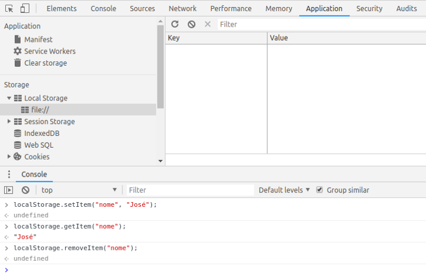

# Add_Remove_LocalStorage
Como salvar no localStorage e remover do localStorage | PHP

### Tecnologias 
PHP 8.0

### Storage
https://developer.mozilla.org/pt-BR/docs/Web/API/Storage     

 A interface de Armazenamento da Web Storage API fornece acesso ao armazenamento de      sessão ou armazenamento local para um domínio específico, permitindo que você,    por exemplo, adicione, modifique ou exclua itens de dados armazenados. 

Se você quiser manipular o armazenamento de sessão para um domínio, você chama o método    Window.sessionStorage; Se você quiser manipular o armazenamento local para um    domínio, você chama Window.localStorage.

Debug

